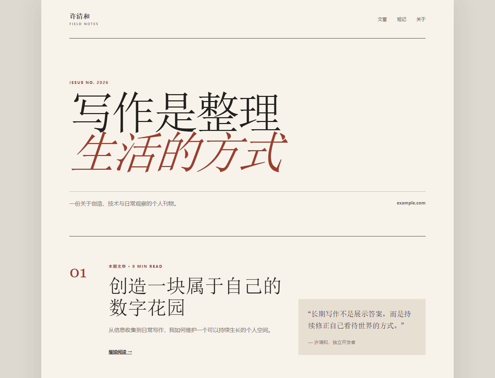

# v2ray Resume Page

Editorial React + TypeScript + Vite personal blog with a paper-inspired layout and no background image, built for Caddy deployment through `v2ray-manager`.

Run `npm install` and `npm run build` to refresh `dist/`. The committed deployment manifest contains a SHA-256 checksum for every installed file.
